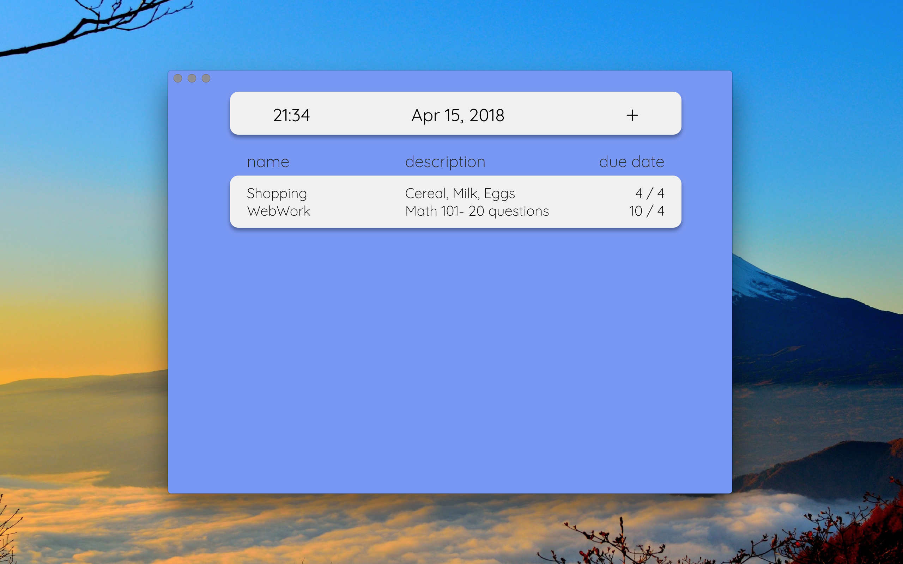

# HEAP 

Prioritized to-do. Throw in books you want to read, coding projects you want to finish, etc. It will change the order to reflect the importance of the task, how long it takes, and when it is due.

